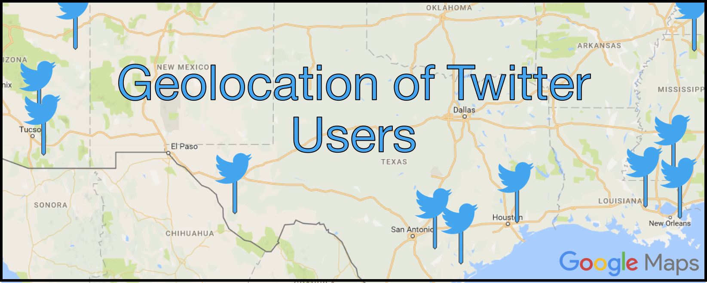
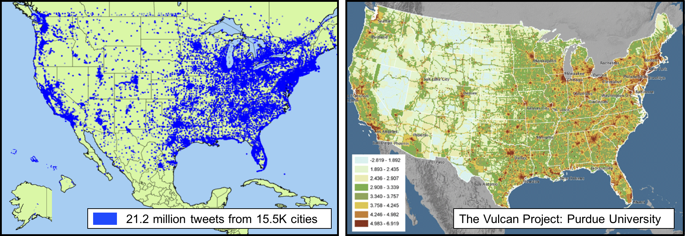
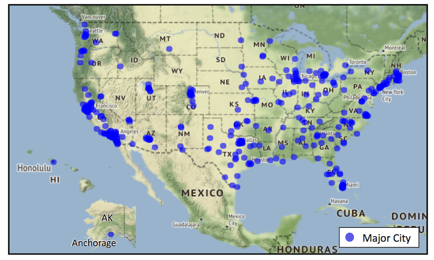
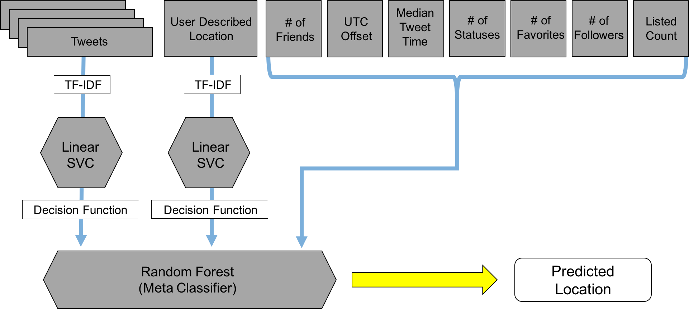
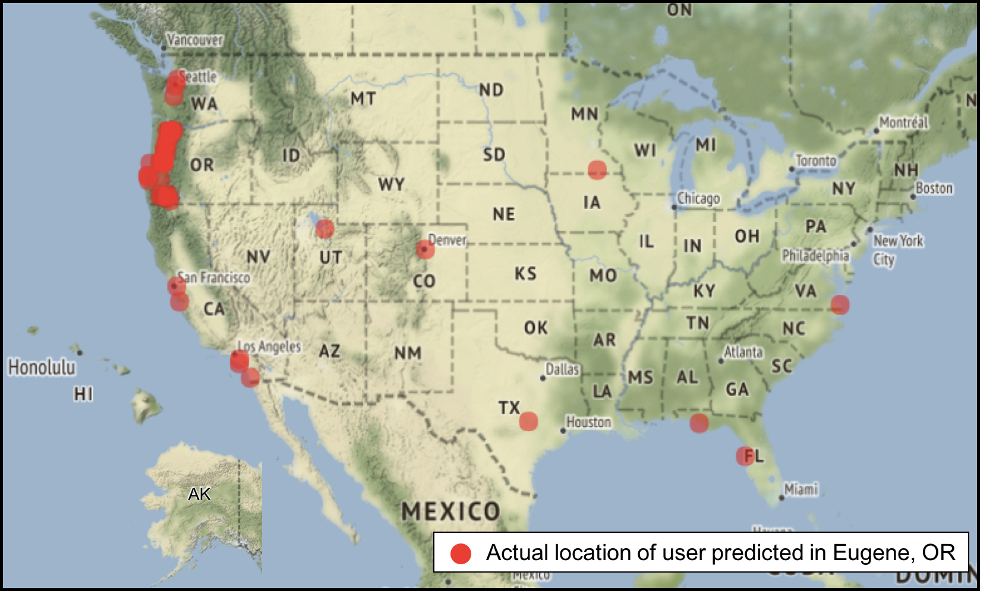
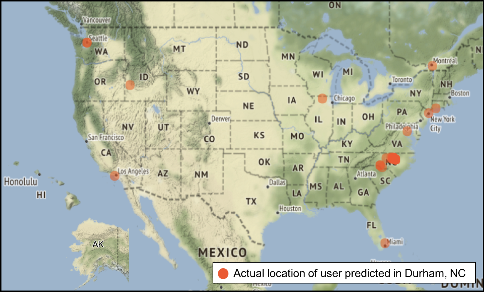
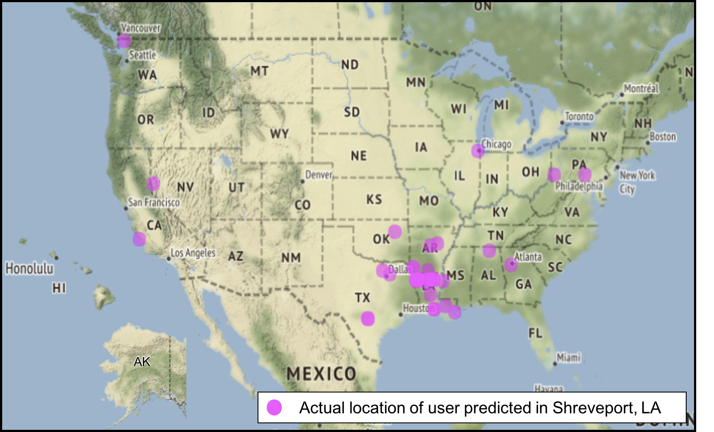
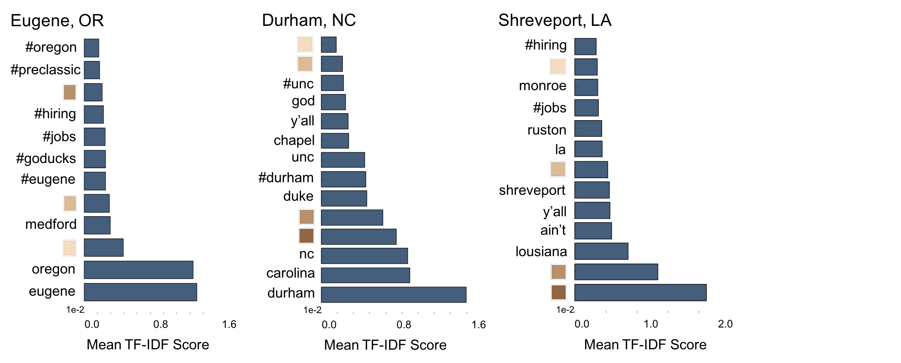
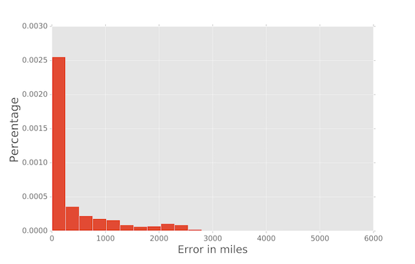
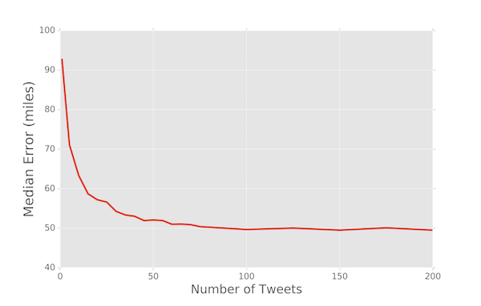

## Motivation for the Project

I have a background in infectious disease epidemiology and when I was in graduate school there was a lot of interest in using things like Google search queries, Facebook posts, and tweets to try to track the spread of infectious diseases in real-time. One of the limitations to using Twitter is that only about 1% of tweets are geotagged with the location of the tweet, which can make much of this work very difficult. For this project, I used the 1% of tweets that are geotagged to train a model to predict the US city-level location of Twitter users that do not geotagged their tweets. This is how I did it:

## Streaming Training Tweets Using Tweepy

[Tweepy](http://www.tweepy.org/) is a python wrapper for the Twitter API that allowed me to easily collect tweets in real-time and store them in MongoBD. The below script was run on an Amazon Web Services EC2 instance with 200 GiB of storage for roughly two weeks using tmux. By filtering based on location, I only received geotagged tweets with a known location to use for training the model.

```python
import tweepy
import json
from pymongo import MongoClient

class StreamListener(tweepy.StreamListener):
    """tweepy.StreamListener is a class provided by tweepy used to access
    the Twitter Streaming API to collect tweets in real-time.
    """

    def on_connect(self):
        """Called when the connection is made"""
        print("You're connected to the streaming server.")

    def on_error(self, status_code):
        """This is called when an error occurs"""
        print('Error: ' + repr(status_code))
        return False

    def on_data(self, data):
        """This will be called each time we receive stream data"""
        client = MongoClient()

        # I stored the tweet data in a database called 'training_tweets' in MongoDB, if 
        # 'training_tweets' does not exist it will be created for you.
        db = client.training_tweets

        # Decode JSON
        datajson = json.loads(data)

        # I'm only storing tweets in English. I stored the data for these tweets in a collection 
        # called 'training_tweets_collection' of the 'training_tweets' database. If 
        # 'training_tweets_collection' does not exist it will be created for you. 
        if "lang" in datajson and datajson["lang"] == "en":
            db.training_tweets_collection.insert_one(datajson)


if __name__ == "__main__":

    # These are provided to you through the Twitter API after you create a account
    consumer_key = "your_consumer_key"
    consumer_secret = "your_consumer_secret"
    access_token = "your_access_token"
    access_token_secret = "your_access_token_secret"

    auth1 = tweepy.OAuthHandler(consumer_key, consumer_secret)
    auth1.set_access_token(access_token, access_token_secret)

    # LOCATIONS are the longitude, latitude coordinate corners for a box that restricts the 
    # geographic area from which you will stream tweets. The first two define the southwest
    # corner of the box and the second two define the northeast corner of the box. 
    LOCATIONS = [-124.7771694, 24.520833, -66.947028, 49.384472,        # Contiguous US
                 -164.639405, 58.806859, -144.152365, 71.76871,         # Alaska
                 -160.161542, 18.776344, -154.641396, 22.878623]        # Hawaii

    stream_listener = StreamListener(api=tweepy.API(wait_on_rate_limit=True))
    stream = tweepy.Stream(auth=auth1, listener=stream_listener)
    stream.filter(locations=LOCATIONS)
```

## Feature Selection, Feature Engineering, and Data Cleaning

### *Feature Selection*

At the end of two weeks I had collected data from over 21 million tweets from over 15,500 cities. In addition to the tweet itself, the API provides a number of other fields, these are the fields I used to build the model:

| FIELD              | TYPE                           |DESCRIPTION                                                           |
|--------------------|--------------------------------|----------------------------------------------------------------------|
|'text'              |String                          |The actual UTF-8 text of the tweet                                    |
|'country_code'      |String                          |Country code representing the country that tweet was sent from        |
|'full_name'         |String                          |Full representation of the place the tweet was sent from. For the                                                              US, often in the form of 'City, State,' but not always.               |
|'coordinates'       |Array of Array of Array of Float|A series of longitude and latitude points that define a bounding box                                                          from where the tweet was sent                                         |
|'screen_name'       |String                          |The screen name chosen by the user                                    |
|'favourites_count'  |Int                             |The number of tweets this user has liked in the account’s lifetime    |
|'followers_count'   |Int                             |The number of followers the user currently has                        |
|'statuses_count'    |Int                             |The number of tweets (including retweets) issued by the user          |
|'friends_count'     |Int                             |The number of users the user is following (AKA their “followings”)    |
|'listed_count'      |Int                             |The number of public lists the user is a member of                    |
|'location'          |String                          |The user-defined location for the account’s profile, which is not                                                              necessarily a geographic location (e.g., 'the library,' 'watching a                                                            movie,' 'in my own head,' 'The University of Texas') (*Nullable*)     |
|'created_at'        |String                          |The UTC datetime of when the tweet was issued                         |
|'utc_offset'        |Int                             |The offset from GMT/UTC in seconds based the Time Zone that the user                                                          selects for their profile (*Nullable*)                                |

To pull these fields I first exported the data from MongoDB as a json file:

```
$ mongoexport --db training_tweets --collection training_tweets_collection --out training_tweets.json
```

I then converted training_tweets.json to a csv file and pulled only the fields from the table above (SRC/Cleaning_tweets/tweets_json_to_csv.py). From this point forward I was able to read and manipulate the csv file as a pandas DataFrame:

```python 
import pandas as pd

df = pd.read_csv('training_tweets.csv', encoding='utf-8')  # 'utf-8' ensures that emojis are preserved 
```

### *Feature Engineering*

#### 'centroid'

Instead of providing the exact latitude and longitude of the tweet, the Twitter API provides a polygonal bounding box of coordinates that encloses the place where the tweet was sent. To facilitate plotting the tweets on a map and other functions, I found the centroid of each bounding box:

```python 
def find_centroid(row):
    '''
    Helper function to return the centroid of a polygonal bounding box of longitude, latitude coordinates
    '''
    
    try:
        row_ = eval(row)
        lst_of_coords = [item for sublist in row_ for item in sublist]
        longitude = [p[0] for p in lst_of_coords]
        latitude = [p[1] for p in lst_of_coords]
        return (sum(latitude) / float(len(latitude)), sum(longitude) / float(len(longitude)))
    except:
        return None
        
# Create a new column called 'centroid' 
df['centroid'] = map(lambda row: find_centroid(row), df['bounding_box'])
```

Using the centroids I was able to plot the training tweets on a map using the Matplotlib Basemap Toolkit (SRC/Plotting/matplotlib_basemap.py). The plot on the right is from the Vulcan Project at Purdue University and shows carbon footprints in the contiguous US. As you can see, the plots are very similiar providing one indication that streaming tweets in this way provides a representative sample of the US population in terms of geographic location.



#### 'tweet_time_secs'

The field 'created_at' is the UTC datetime of when the tweet was issued. Here is an example:

```python
u'created_at': u'Sun Apr 30 01:23:27 +0000 2017'
```
I was not interested in the date that the tweet was sent, but I was interested in the UTC time that the tweet was sent since there are likely geographic differences in these values. I therefore parsed this information from the time stamp and reported this value in seconds.

```python
from dateutil import parser

def get_seconds(row):
    '''
    Helper function to parse time from a datetime stamp and return the time in seconds
    '''
    
    time_str = parser.parse(row).strftime('%H:%M:%S')
    h, m, s = time_str.split(':')
    return int(h) * 3600 + int(m) * 60 + int(s)

# Create a new column called 'tweet_time_secs'
df['tweet_time_secs'] = map(lambda row: get_seconds(row), df['created_at'])
```

### *Data Cleaning*

#### Missing Data

Both 'user_described_location' (note: the API calls this field 'location') and 'utc_offset' are nullable fields that frequently contain missing values. When this was the case, I filled them in with indicator values:

```python
df['user_described_location'].fillna('xxxMISSINGxxx', inplace=True)
df['utc_offset'].fillna(999999, inplace=True)
```

Additionally, a small percentage of tweets contained missing values for 'country_code.' When this occurred, or other missing data occurred, I chose to drop the entire row:

```python
df.dropna(axis=0, inplace=True)
```

#### Tweets Outside the US

The bounding box I used to filter tweets from the contiguous US during the streaming process did not perfectly fit the contiguous US; therefore, I also collected a number of tweets from outside the US. Since the goal for this project was to predict the US city-level location of Twitter users, if the tweet occured outside the US I relabelled all these tweets with a single label. For tweets outside the US, 'country_code' was relabelled to 'NOT_US' and 'geo_location' (note: the API calls this field 'full_name') was relabelled to 'NOT_IN_US, NONE':

```python
def relabel_geo_locations(row):
    '''
    Helper function to relabel the geo_locations from tweets outside the US
    to 'NOT_IN_US, NONE'
    '''
    
    if row['country_code'] == 'US':
        return row['geo_location']
    else:
        return 'NOT_IN_US, NONE'
    
# Relabel 'country_code' for tweets outside the US to 'NOT_US'
    df['country_code'] = map(lambda cc: cc if cc == 'US' else 'NOT_US', df['country_code'])
    
# Relabel 'geo_location' for tweets outside the US to 'NOT_IN_US, NONE'
df['geo_location'] = df.apply(lambda row: relabel_geo_locations(row), axis=1)
```

#### Tweets Lacking a 'City, State' Location Label

Most tweets that originated in the US had a 'geo_location' in the form of 'City, State' (e.g., 'Austin, TX'). For some tweets, however, the label was less specific and in the form of 'State, Country' (e.g., 'Texas, USA') or even worse in the form of a totally unique value (e.g., 'Tropical Tan'). Since this data was going to be used to train the model, I wanted to have as granular of a label as possible for each tweet. Therefore, I only kept tweets that were in the form of 'City, State' and dropped all others:

```python
def geo_state(row):
    '''
    Helper function to parse the state code for 'geo_location' labels 
    in the form of 'City, State'
    '''
    
    try:
        return row['geo_location'].split(', ')[1]
    except:
        return None
        
# Create a new column called 'geo_state' 
df['geo_state'] = df.apply(lambda row: geo_state(row),axis=1)

# The 'geo_state' column will contain null values for any row where 'geo_location' was not 
# comma separated (e.g., 'Tropical Tan'). We drop those rows here:
df.dropna(axis=0, inplace=True)

# list of valid geo_state labels. "NONE" is the label I created for tweets outside the US
states = ["AL", "AK", "AZ", "AR", "CA", "CO", "CT", "DC", "DE", "FL", "GA", "HI", "ID", 
          "IL", "IN", "IA", "KS", "KY", "LA", "ME", "MD", "MA", "MI", "MN", "MS", "MO", 
          "MT", "NE", "NV", "NH", "NJ", "NM", "NY", "NC", "ND", "OH", "OK", "OR", "PA", 
          "RI", "SC", "SD", "TN", "TX", "UT", "VT", "VA", "WA", "WV", "WI", "WY", "NONE"]

# Keep only rows with a valid geo_state, among others this will drop all rows that had 
# a 'geo_location' in the form of 'State, Country' (e.g., 'Texas, USA')
df = df[df['geo_state'].isin(states)]
```

#### Aggregating the Tweets by User

During the two week collection period many users tweeted more than once. To prevent potential leakage I grouped the tweets by user ('screen_name'), then aggregated the remaining fields.

```python
from collections import Counter

# aggregation functions
agg_funcs = {'tweet' : lambda x: ' '.join(x), 
             'geo_location' : lambda x: Counter(x).most_common(1)[0][0],
             'geo_state' : lambda x: Counter(x).most_common(1)[0][0],
             'user_described_location': lambda x: Counter(x).most_common(1)[0][0],
             'utc_offset': lambda x: Counter(x).most_common(1)[0][0],
             'geo_country_code': lambda x: Counter(x).most_common(1)[0][0],
             'tweet_time_secs' : np.median, 
             'statuses_count': np.max,
             'friends_count' :np.mean,
             'favourites_count' : np.mean,
             'listed_count' : np.mean,
             'followers_count' : np.mean}

# Groupby 'screen_name' and then apply the aggregation functions in agg_funcs
df = df.groupby(['screen_name']).agg(agg_funcs).reset_index()
```

#### Remapping the Training Tweets to the Closest Major City

Since the training tweets came from over 15,500 cities, and I didn't want to do a 15,500-wise classification problem, I used the centroids to remap all the training tweets to their closest major city from a list of 378 major US cities based on population (plus the single label for tweets outside the US, which were all remapped to Toronto)(SRC/Cleaning_tweets/remapping_to_major_city.py). This left me with a 379-wise classification problem. Here is a plot of those major cities:



## Building the Predictive Model

The steps below were run on an Amazon Web Services r3.8xlarge EC2 instance with 244 GiB of memory. Here is a high-level overview of the final model:

### *High-level Overview of the Stacked Model*



### Step 1: Load dependencies and prepare the cleaned data for model fitting

```python
import pandas as pd
import numpy as np
import nltk
from nltk.tokenize import TweetTokenizer
from sklearn.feature_extraction.text import TfidfVectorizer
from sklearn.svm import LinearSVC
from sklearn.ensemble import RandomForestClassifier
from sklearn.externals import joblib

# Tokenizer to use for text vectorization
def tokenize(tweet):
    tknzr = TweetTokenizer(strip_handles=True, reduce_len=True, preserve_case=False)
    return tknzr.tokenize(tweet)

# Read cleaned training tweets file into pandas and randomize it
df = pd.read_pickle('cleaned_training_tweets.pkl')
randomized_df = df.sample(frac=1, random_state=111)

# Split randomized_df into two disjoint sets
half_randomized_df = randomized_df.shape[0] / 2
base_df = randomized_df.iloc[:half_randomized_df, :]      # used to train the base classifiers
meta_df = randomized_df.iloc[half_randomized_df:, :]      # used to train the meta classifier

# Create variables for the known the geotagged locations from each set
base_y = base_df['closest_major_city'].values
meta_y = meta_df['closest_major_city'].values
```

### Step 2: Train a base-level Linear SVC classifier on the user described locations

```python
# Raw text of user described locations
base_location_doc = base_df['user_described_location'].values
meta_location_doc = meta_df['user_described_location'].values

# fit_transform a tf-idf vectorizer using base_location_doc and use it to transform meta_location_doc
location_vectorizer = TfidfVectorizer(stop_words='english', tokenizer=tokenize, ngram_range=(1,2))
base_location_X = location_vect.fit_transform(base_location_doc.ravel())
meta_location_X = location_vect.transform(meta_location_doc)

# Fit a Linear SVC Model with 'base_location_X' and 'base_y'. Note: it is important to use 
# balanced class weights otherwise the model will overwhelmingly favor the majority class.
location_SVC = LinearSVC(class_weight='balanced')
location_SVC.fit(base_location_X, base_y)

# We can now pass meta_location_X into the fitted model and save the decision 
# function, which will be used in Step 4 when we train the meta random forest
location_SVC_decsfunc = location_SVC.decision_function(meta_location_X)

# Pickle the location vectorizer and the linear SVC model for future use
joblib.dump(location_vectorizer, 'USER_LOCATION_VECTORIZER.pkl')
joblib.dump(location_SVC, 'USER_LOCATION_SVC.pkl')
```
### Step 3: Train a base-level Linear SVC classifier on the tweets

```python
# Raw text of tweets
base_tweet_doc = base_df['tweet'].values
meta_tweet_doc = meta_df['tweet'].values

# fit_transform a tf-idf vectorizer using base_tweet_doc and use it to transform meta_tweet_doc
tweet_vectorizer = TfidfVectorizer(stop_words='english', tokenizer=tokenize)
base_tweet_X = tweet_vectorizer.fit_transform(base_tweet_doc.ravel())
meta_tweet_X = tweet_vectorizer.transform(meta_tweet_doc)

# Fit a Linear SVC Model with 'base_tweet_X' and 'base_tweet_y'. Note: it is important to use 
# balanced class weights otherwise the model will overwhelmingly favor the majority class.
tweet_SVC = LinearSVC(class_weight='balanced')
tweet_SVC.fit(base_tweet_X, base_y)

# We can now pass meta_tweet_X into the fitted model and save the decision 
# function, which will be used in Step 4 when we train the meta random forest
tweet_SVC_decsfunc = tweet_SVC.decision_function(meta_tweet_X)

# Pickle the tweet vectorizer and the linear SVC model for future use
joblib.dump(tweet_vectorizer, 'TWEET_VECTORIZER.pkl')
joblib.dump(tweet_SVC, 'TWEET_SVC.pkl')
```

### Step 4: Train a meta-level Random Forest classifier

```python
# additional features from meta_df to pull into the final model
friends_count = meta_df['friends_count'].values.reshape(meta_df.shape[0], 1)
utc_offset = meta_df['utc_offset'].values.reshape(meta_df.shape[0], 1)
tweet_time_secs = meta_df['tweet_time_secs'].values.reshape(meta_df.shape[0], 1)
statuses_count = meta_df['statuses_count'].values.reshape(meta_df.shape[0], 1)
favourites_count = meta_df['favourites_count'].values.reshape(meta_df.shape[0], 1)
followers_count = meta_df['followers_count'].values.reshape(meta_df.shape[0], 1)
listed_count = meta_df['listed_count'].values.reshape(meta_df.shape[0], 1)

# np.hstack these additional features together
add_features = np.hstack((friends_count, 
                          utc_offset, 
                          tweet_time_secs,
                          statuses_count,
                          favourites_count,
                          followers_count,
                          listed_count))

# np.hstack the two decision function variables from steps 2 & 3 with add_features
meta_X = np.hstack((location_SVC_decsfunc,        # from Step 2 above
                    tweet_SVC_decsfunc,           # from Step 3 above
                    add_features))

# Fit Random Forest with 'meta_X' and 'meta_y'
meta_RF = RandomForestClassifier(n_estimators=60, n_jobs=-1)
meta_RF.fit(meta_X, meta_y)

# Pickle the meta Random Forest for future use
joblib.dump(meta_RF, 'META_RF.pkl')
```

## Testing the Model

### Collecting and Preparing a Fresh Data Set

A week after I collected the training data set, I collected a fresh data set to use to evaluate the model. For this, I followed the same data collection and preparation procedures as above with a few of exceptions:  1) I only ran the Tweepy script for 48 hours, 2) I removed any users from the evaluation data set that were in the training data set, and 3) for the users that remained in the data set I went back to the Twitter API and pulled the 200 most recent tweets for each user (SRC/Streaming_tweets/add_200_tweets.py). Remember the goal for the model was to predict the US city-level location of Twitter users, not individual tweets; therefore, by giving the model a larger corpus of tweets for each user, I hoped to increase the model's accuracy.

### Making Predictions on the Fresh Data Set

```python
import pandas as pd
import numpy as np
from sklearn.externals import joblib
import nltk
from nltk.tokenize import TweetTokenizer

def tokenize(tweet):
    tknzr = TweetTokenizer(strip_handles=True, reduce_len=True, preserve_case=False)
    return tknzr.tokenize(tweet)

class UserLocationClassifier: 
    
    def __init__(self):
        '''
        Load the stacked classifier's pickled vectorizers, base classifiers, and meta classifier
        '''
        
        self.location_vectorizer = joblib.load('USER_LOCATION_VECTORIZER.pkl')
        self.location_SVC = joblib.load('USER_LOCATION_SVC.pkl')
        self.tweet_vectorizer = joblib.load('TWEET_VECTORIZER.pkl')
        self.tweet_SVC = joblib.load('TWEET_SVC.pkl')
        self.meta_RF = joblib.load('META_RF.pkl')
    
    def predict(self, df):
        '''
        INPUT: Cleaned and properly formatted dataframe to make predictions for
        OUTPUT: Array of predictions
        '''
        # Get text from 'user_described_location' column of DataFrame
        location_doc = df['user_described_location'].values
        
        # Convert the '200_tweets' column from a list to just a string of all tweets
        df.loc[:, '200_tweets'] = map(lambda x: ''.join(x), df['200_tweets'])
        
        # Get text from '200_tweets' column of DataFrame
        tweet_doc = df['200_tweets'].values
        
        # Vectorize 'location_doc' and 'tweet_doc'
        location_X = self.location_vectorizer.transform(location_doc.ravel())
        tweet_X = self.tweet_vectorizer.transform(tweet_doc.ravel())
        
        # Store decision functions for 'location_X' and 'tweet_X'
        location_decision_function = self.location_SVC.decision_function(location_X)
        tweet_decision_function = self.tweet_SVC.decision_function(tweet_X)
        
        # Get additional features to pull into the Random Forest
        friends_count = df['friends_count'].values.reshape(df.shape[0], 1)
        utc_offset = df['utc_offset'].values.reshape(df.shape[0], 1)
        tweet_time_secs = df['tweet_time_secs'].values.reshape(df.shape[0], 1)
        statuses_count = df['statuses_count'].values.reshape(df.shape[0], 1)
        favourites_count = df['favourites_count'].values.reshape(df.shape[0], 1)
        followers_count = df['followers_count'].values.reshape(df.shape[0], 1)
        listed_count = df['listed_count'].values.reshape(df.shape[0], 1)

        # np.hstack additional features together
        add_features = np.hstack((friends_count, 
                               utc_offset, 
                               tweet_time_secs,
                               statuses_count,
                               favourites_count,
                               followers_count,
                               listed_count))
        
        # np.hstack the two decision function variables with add_features
        meta_X = np.hstack((location_decision_function, tweet_decision_function, add_features))

        # Feed meta_X into Random Forest and make predictions
        return self.meta_RF.predict(meta_X)

if __name__ == "__main__":
    
    # Load evaluation_df into pandas DataFrame
    evaluation_df = pd.read_pickle('evaluation_df.pkl')
    
    # Load UserLocationClassifier
    clf = UserLocationClassifier()
    
    # Get predicted locations
    predictions = clf.predict(evaluation_df)
    
    # Create a new column called 'predicted_location'
    evaluation_df.loc[:, 'predicted_location'] = predictions
    
    # Pickle the resulting DataFrame with the location predictions
    evaluation_df.to_pickle('evaluation_df_with_predictions.pkl')
```

### Plotting the Locations of Twitter Users on a Map Using Bokeh

Here are some examples of how the model performed on a few selected cities. For each of the maps shown below, the dots indicate the user's true location while the title of the map indicates where the model predicted them to be. As you can see, for each city there is a tight cluster in and around the correct location, with only a handfull for way off misses. The code for generating these plots can be found at SRC/Plotting/bokeh_maps.py (note: the final plots shown here were constructed in Photoshop after first using the 'pan' and 'wheel_zoom' tools in Bokeh to capture screenshots of the contiguous US, Alaska, and Hawaii): 

### *Example 1: Eugene, OR* 



### *Example 2: Durham, NC* 



### *Example 3: Shreveport, LA* 



### Tweet Term Importances for these Cities

To get an idea of what tweet terms were important for predicting these cities, I went through and calculated mean tf-idf values for each of these cities. Below are some of the more interesting terms for each of these cities. To generate these plots I followed an excellent guide written by [Thomas Buhrmann](https://buhrmann.github.io/tfidf-analysis.html).   



#### *Emoji Skin Tone Modifications*

|Emoji| Description          |
|-----|----------------------|
|🏻   |Light Skin Tone       |
|🏼   |Medium-Light Skin Tone|
|🏽   |Medium Skin Tone      |
|🏾   |Medium-Dark Skin Tone |
|🏿   |Dark Skin Tone        |

One of the more interesting things to fall out of the model was the colored boxes shown above. These represent the skin tone modifications you can add to certain emojis. For most emojis there was not a strong geographic signal; however, for the skin tone modifications there was. As you can see in the term importances plots, Twitter users in Eugene, OR, tended to use lighter colored skin tone modifications while users in Durham, NC, and Shreveport, LA, tended to use darker skin tone modifications. 

### Scoring the Model

#### *Median Error: 49.6 miles*

To score the model I chose to use median error, which came out to be 49.6 miles. This was calculated by using the centroids to find the great-circle distance between the predicted city and the true location (SRC/Scoring_the_model/great_circle_distance.py).

#### *Histogram of Error Distances*



#### *Influence of Tweet Number on the Model's Accuracy*

Recall that for each user I wanted to make prediction on I went back to the API and pulled 200 of their most recent tweets. The plot below was generated using the same procedure as above with increasing numbers of tweets for each user. I originally chose 200 because this is the maximum number the API allows you to pull per distinct request. However, as you can see in the plot below, after about 100 tweets there is negligible improvement in the model's accuracy, meaning for future use it might not be necessary to pull so many tweets for each user.



## Final Notes

While a median error of 49.6 miles is pretty good, there is still plenty of room for improvement. Running the Tweepy streaming script for a longer period of time and having a larger collection of training data would likely give an immediate improvement. Additionally, with more training data, you could also include more than 379 classification labels, which would also help to decrease the median error of the model. That said, given the time constraints of the project, I'm satisfied with the current model's accuracy and think it could be a valuable resource to many projects where having an extremely granular estimate of a Twitter user's location is not required.

